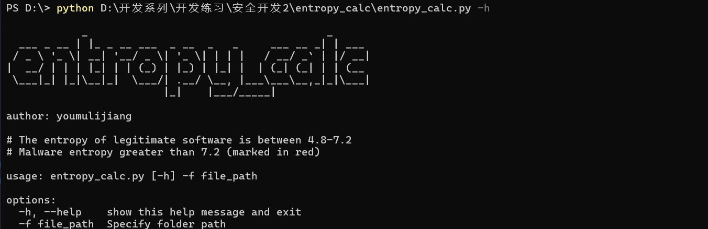
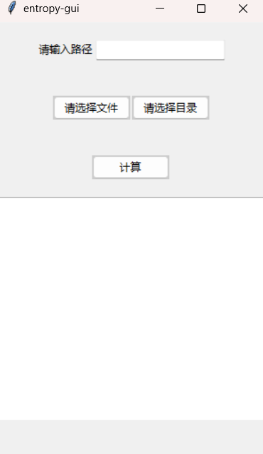

# entropy_calc

## 介绍

entropy_calc能够计算出文件的熵

## 下载

```txt
git clone https://github.com/youmulijiang.git
cd entropy_calc
python entopy_calc.py 
python entropy_calc-gui.py #开启gui界面
```

## 使用截图





## 作者

作者是一个安全开发成员，如果该项目对你有帮助，请点右上角的⭐

梨酱最喜欢⭐⭐啦 ヾ(≧▽≦*)o
